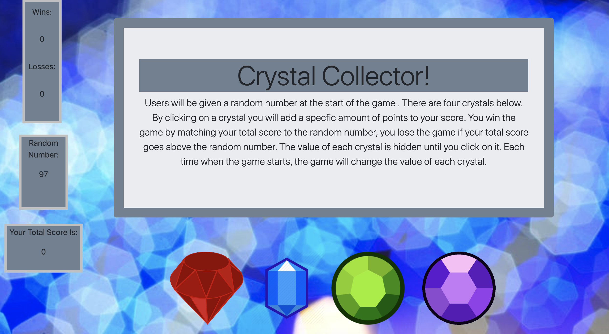

# Crystal Collector

## Summary
Users will be given a random number at the start of the game . There are four crystals below. By clicking on a crystal you will add a specfic amount of points to your score. You win the game by matching your total score to the random number, you lose the game if your total score goes above the random number. The value of each crystal is hidden until you click on it. Each time when the game starts, the game will change the value of each crystal.

## Instructions
1. Check what the random number is.
2. Click on the crystals to see what numbers they are equivalent to.
3. Try and match the total number to the random number by clicking the gems.

## Technologies Used

## Authors
- Eric Max Valdivia - https://github.com/Ericv0801
